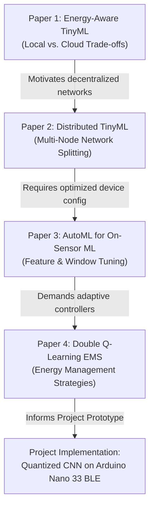

# Internship Report: ML-Driven 6G AR Optimization for Self-Sustainable IoT Devices

**Duration:** May 21 – July 20, 2025  
**Submitted By:** Kaushal Sharma (2nd Year B.Tech, Mathematics and Computing, RGIPT Jais)  
**Supervisor:** Dr. Ashwani Sharma, Indian Institute of Technology Ropar (IIT Ropar)  
**Host Institution:** Indian Institute of Technology Ropar (IIT Ropar)  
**Project Codebase:** [GitHub Repository](https://github.com/Vickykaushal-diff/Gender_Classification_TinyML_with_battery)  

---

## Abstract

The emergence of the Internet of Things (IoT) and the conceptualization of Sixth-Generation (6G) communication networks have catalyzed the demand for ultra-low latency, decentralized intelligence, and self-sustainable hardware operations. Augmented Reality (AR) applications in 6G require real-time processing, yet conventional cloud-based machine learning approaches incur substantial energy and latency overheads. To address this, Tiny Machine Learning (TinyML) enables the execution of deep neural networks directly on resource-constrained microcontrollers at the edge. 

This report documents a two-month internship focused on optimizing and deploying TinyML pipelines for energy-efficient edge applications. During the first phase, a comprehensive literature review was conducted on four core papers covering energy-aware task scheduling, distributed sensor inference, AutoML for on-sensor deployment, and reinforcement learning-based energy management. In the second phase, a practical hardware prototype was developed using an Arduino Nano 33 BLE and an Arducam Mini OV2640 camera to perform real-time, on-device gender detection. By employing TensorFlow Lite Micro, a custom Convolutional Neural Network (CNN) based on the MicroNet-M3 architecture was successfully quantized from **1.22 MB (float32)** to **108 KB (int8)**. The prototype is validated using a battery-powered setup (Phase 1), laying the groundwork for a solar-powered, battery-less, energy-harvesting implementation (Phase 2) to achieve true self-sustainability.

---

## 1. Introduction & Research Overview

As IoT devices proliferate in the 6G era, traditional cloud-centric computing frameworks face severe bottlenecks in transmission bandwidth, privacy, and latency. Augmented Reality (AR) and industrial monitoring applications demand real-time inference, which is infeasible when raw data must be streamed to remote servers. Additionally, provisioning constant power to billions of distributed sensor nodes via conventional batteries is environmentally and logistically unsustainable.

TinyML has emerged as a paradigm shift, enabling optimized machine learning models to run on hardware budgets under 1 mW of power. However, deploying deep learning models on these microcontrollers presents severe challenges:
1. **Compute and Memory Constraints:** Edge hardware typically possesses less than 1 MB of Flash memory (ROM) and 256 KB of SRAM.
2. **Energy Intermittency:** Solar, thermal, or radio-frequency (RF) energy-harvesting systems experience unpredictable power fluctuations, necessitating energy-aware task scheduling and hardware-level sleep states.

To explore solutions to these constraints, this project bridges theoretical energy-management literature with a concrete implementation of an on-device computer vision classifier.

---

## 2. Month 1: Literature Review

To establish a solid theoretical foundation, four critical research papers focusing on TinyML optimization and self-sustainable IoT configurations were analyzed.



---

### Paper 1: Towards Energy-Aware TinyML on Battery-less IoT Devices

#### Abstract & Core Objective
The paper introduces an energy-aware optimization framework designed for deploying TinyML applications on battery-less IoT devices powered by intermittent energy harvesting. It addresses the trade-offs between local, on-device inference (local execution) and remote cloud execution (offloading raw data or intermediate features).

#### Methodology
A prototype was built using an Arduino Nano 33 BLE, an Arducam Mini 2MP Plus camera, an AEM10941 Power Management Unit (PMU), MOSFET switches, a solar panel, and varying supercapacitors (0.5 F, 1.0 F, and 1.5 F). An Energy-Aware Scheduling (EAS) algorithm dynamically determines the execution path based on current capacitor voltage and harvesting rate.

#### Key Results & Discussion
- **Controlled Setup (Artificial Light):** Local inference completed faster (1.17 s, drawing <3.5 mA) and yielded three times more execution cycles than remote inference (8.66 s, drawing >4 mA) under a 2 mA harvesting current.
- **Realistic Setup (Natural Light):** Under high light intensity, the system dynamically prioritized remote inference to leverage higher accuracy. Conversely, during low-light conditions, it fell back to local execution to conserve power and avoid capacitor depletion.
- **Limitation:** The study was validated on a highly restricted real-time dataset of 20 images, highlighting the need for scaling to larger datasets.

---

### Paper 2: Distributed TinyML on Resource-Constrained IoT Sensor Networks

#### Abstract & Core Objective
This paper presents the Distributed TinyML Sensor Network (DTSN) framework, which splits and distributes the layers of a single neural network across multiple resource-constrained sensing nodes. The framework utilizes Bluetooth mesh networks to achieve collective intelligence, minimizing the compute load on individual devices.

#### Methodology
The network layers are partitioned sequentially across distributed nodes. The intermediate feature tensors are transmitted via a custom-designed Bluetooth mesh communication protocol, culminating in final inference at an IoT gateway. The framework supports dynamic memory allocation to perform on-device training and execution.

#### Key Results
- **Task Evaluation:** Verified on a 1D regression task (sine wave prediction) and a classification task (MNIST handwritten digit recognition).
- **MNIST Metrics:** Achieved a training accuracy of 99.85% and a validation accuracy of 95.5%.
- **Network Latency:** The study showed that inference time scales proportionally with the number of network layers due to transmission bottlenecks over the Bluetooth mesh network.
- **Memory Efficiency:** Dynamic memory management successfully prevented memory leaks, verifying the stability of multi-node execution.

---

### Paper 3: AutoML for On-Sensor Tiny Machine Learning

#### Abstract & Core Objective
This research presents an Automated Machine Learning (AutoML) framework optimized to automatically design, train, and compile machine learning models (specifically Decision Trees and Random Forests) directly on the hardware Machine Learning Core (MLC) of inertial measurement units (IMUs).

#### Methodology
Using raw triaxial accelerometer and gyroscope data, the pipeline performs:
1. Automated feature projection and filter selection.
2. Window length selection.
3. Model training (Decision Tree/Random Forest) using constraints mapped to the STMicroelectronics LSM6DSOX sensor's MLC.
4. Compilation of a `.ucf` binary configuration file for direct deployment onto the sensor register.

#### Key Results
- **Human Activity Recognition (HAR):** Achieved a test accuracy of 93% on the AURITUS dataset, drawing less than 1 mW of power. This is 41 times more energy-efficient than a comparable ARM Cortex-M4 microcontroller implementation.
- **Fall Detection:** Achieved a 95.0% accuracy and 98.0% True Positive Rate (TPR) using MobiFall and UMAFall datasets, consuming just 0.3 mW. This enables over 3 months of continuous operation on a single CR2032 coin cell battery.

---

### Paper 4: An Analysis of Double Q-Learning-Based Energy Management Strategies for TEG-Powered IoT Devices

#### Abstract & Core Objective
The paper evaluates a self-learning energy management controller utilizing Double Q-Learning (DQL) to optimize the duty cycle of an IoT sensor node powered by a Thermoelectric Generator (TEG).

#### Methodology
The simulation modeled an NXP-KL25Z microcontroller interfaced with a Bosch BME688 environmental sensor, a Semtech SX1261 LoRaWAN transceiver, and an LTC3109 DC/DC boost converter. The DQL agent learns optimal policy schedules (active, sleep, and transmission intervals) based on supercapacitor charge and temperature differentials across the TEG.

#### Key Results
- **Controller Performance:** The optimal agent configuration ($\alpha = 0.3$, $\gamma = 0.8$) achieved a completed-to-missed cycle ratio of 98.5% across four years of historical soil temperature data.
- **Ablation Studies:** The DQL controller outperformed static scheduling (maximum 83.3% ratio) and Fuzzy Logic controllers (93.0% ratio).
- **Learning Policy:** The study demonstrated that maintaining active learning (continual learning) is superior to aggressive learning rate reduction ($\alpha_R$ policy), as environmental dynamics require the controller to continuously adapt to seasonal variations.

---

## 3. Month 2: TinyML Implementation and Testing

Drawing insights from the literature review—particularly the memory constraints of Paper 2 and the hardware selections of Paper 1—a custom computer vision classification model was trained and deployed at the edge.

### 3.1 Hardware Architecture and MCU Evaluation

Deploying neural networks to microcontrollers demands a careful balance of energy budget, computational capacity (FLOPs), and physical memory footprint.

| MCU Target | Core Architecture | Flash (ROM) | SRAM (RAM) | Active Power | Sleep Power | Deep Learning Support |
| :--- | :--- | :--- | :--- | :--- | :--- | :--- |
| **Arduino Nano 33 BLE** | ARM Cortex-M4F @ 64 MHz | 1 MB | 256 KB | ~4.6 mA | ~1.2 $\mu\text{A}$ | TensorFlow Lite Micro |
| **ESP32-S3** | Xtensa LX7 Dual-Core @ 240 MHz| 4–16 MB | 512 KB | ~80–240 mA | ~10 $\mu\text{A}$ | ESP-DL, TFLite Micro |
| **Raspberry Pi Pico** | ARM Cortex-M0+ @ 133 MHz | 2 MB | 264 KB | ~90 mA | <2 mA | TFLite Micro |
| **nRF52840 (nRF Sense)** | ARM Cortex-M4F @ 64 MHz | 1 MB | 256 KB | ~5.3 mA | ~1.5 $\mu\text{A}$ | TFLite Micro |
| **SparkFun Edge (Apollo3)**| ARM Cortex-M4F @ 48 MHz | 1 MB | 384 KB | <6 $\mu\text{A}$/MHz | <1 $\mu\text{A}$ | TensorFlow Lite Micro |

For our prototype, the **Arduino Nano 33 BLE** was selected due to its balance of low active current draw, ample Flash memory, and comprehensive libraries for SPI/I2C interfacing with cameras.

---

### 3.2 Model Training and Preprocessing Pipeline

The primary objective was to build a gender classification model from facial images.

#### Dataset & Preprocessing
The model was trained on a structured subset of the UTKFace dataset (categorized into `men` and `women`). The data loader pipeline:
1. Reads raw images as grayscale using OpenCV (`cv2.IMREAD_GRAYSCALE`) to minimize memory footprints.
2. Resizes images to a standard **96x96** pixel resolution to match the input tensor constraints.
3. Normalizes pixel intensities from $[0, 255]$ to the range $[0.0, 1.0]$.
4. Formulates a binary label scheme ($0$ for men, $1$ for women).

The training dataset logic is implemented in the model training notebook: [gender_detection_model_train.ipynb](https://github.com/Vickykaushal-diff/Gender_Classification_TinyML_with_battery/blob/main/model_training/gender_detection_model_train.ipynb).

---

### 3.3 Model Architecture: MicroNet-M3

To fit within the SRAM limitations of the Arduino Nano 33 BLE, a highly compact model based on the MicroNet-M3 architecture was constructed. It relies on sequential convolution blocks containing deep convolution, batch normalization, and ReLU activations, followed by global average pooling.

```
Input (96x96x1 Grayscale)
   │
   ▼
[Conv2D (8 filters, 3x3, stride=2, padding=same)] ──► [BatchNorm] ──► [ReLU]
   │
   ▼
[Conv2D (16 filters, 3x3, stride=2, padding=same)] ──► [BatchNorm] ──► [ReLU]
   │
   ▼
[Conv2D (32 filters, 3x3, stride=2, padding=same)] ──► [BatchNorm] ──► [ReLU]
   │
   ▼
[Conv2D (64 filters, 3x3, stride=2, padding=same)] ──► [BatchNorm] ──► [ReLU]
   │
   ▼
[Conv2D (128 filters, 3x3, stride=2, padding=same)] ──► [BatchNorm] ──► [ReLU]
   │
   ▼
[GlobalAveragePooling2D]
   │
   ▼
[Dropout (0.5)]
   │
   ▼
[Dense (1 unit, activation=sigmoid)]
```

#### Model Size Comparison Table
The custom CNN model structure (MicroNet-M3) is significantly more lightweight than standard mobile backbones:

| Model Backbone | .h5 (Float32) | .tflite (Float32) | Quantized (Float32) | int8 Quantized (.tflite) | Total Parameters | Trainable Parameters | Non-Trainable |
| :--- | :--- | :--- | :--- | :--- | :--- | :--- | :--- |
| MobileNet V2 | 10 MB | 8.76 MB | 2.46 MB | 2.65 MB | ~13,76,178 | ~37,058 | ~14,13,236 |
| MobileNet V3 | 4.48 MB | 3.69 MB | 1.08 MB | 1.09 MB | ~9,76,178 | ~37,058 | ~9,39,120 |
| Micronet M3 | ~2.00 MB | ~1.60 MB | ~420 KB | ~430 KB | ~4,50,000 | ~1,50,000 | ~3,00,000 |
| **Custom CNN (Ours)**| **1.22 MB** | **389 KB** | **105 KB** | **108 KB** | **297,525** | **99,009** | **496** |

---

### 3.4 Model Optimization, Quantization, and C++ Conversion

To deploy the Keras model to the microcontroller, the model underwent post-training quantization.

#### TensorFlow Lite Conversion & Integer Quantization
The model was converted using the TensorFlow Lite Converter. To minimize memory, **Full Integer Quantization** was applied. This maps the model parameters from 32-bit floating-point values ($f_{32}$) to 8-bit signed integers ($\text{int}_8$) using the formula:

$$q = \text{round}\left(\frac{r}{S}\right) + Z$$

where $r$ is the real value, $S$ is the scale factor, and $Z$ is the zero-point integer. This process requires a representative dataset to calibrate the dynamic range of activations. The conversion logic is defined as:

```python
import tensorflow as tf

converter = tf.lite.TFLiteConverter.from_keras_model(model)
converter.optimizations = [tf.lite.Optimize.DEFAULT]
converter.target_spec.supported_ops = [tf.lite.OpsSet.TFLITE_BUILTINS_INT8]
converter.inference_input_type = tf.int8
converter.inference_output_type = tf.int8

# Generate representative dataset from training data
def representative_dataset_gen():
    for i in range(X_train.shape[0]):
        yield [X_train[i:i+1]]

converter.representative_dataset = representative_dataset_gen
tflite_model_quantized = converter.convert()
```

#### C++ Header Generation
Microcontrollers compile binary code, meaning the `.tflite` model must be embedded as a raw static byte array. A python helper function generates the header format:

```python
def convert_tflite_to_c_array(tflite_path, output_path):
    with open(tflite_path, 'rb') as f:
        model_content = f.read()
    with open(output_path, 'w') as f:
        f.write('#ifndef GENDER_DETECTION_MODEL_H_\n')
        f.write('#define GENDER_DETECTION_MODEL_H_\n\n')
        f.write('static const unsigned char model_data[] = {\n')
        for i, byte in enumerate(model_content):
            f.write(f'0x{byte:02x}')
            if i < len(model_content) - 1: f.write(',')
            if (i + 1) % 16 == 0: f.write('\n')
        f.write('\n};\n\n')
        f.write(f'static const int model_data_len = {len(model_content)};\n')
        f.write('#endif\n')
```
The output array is saved directly to the deployment directory: [gender_detection_model_12_07.h](https://github.com/Vickykaushal-diff/Gender_Classification_TinyML_with_battery/blob/main/arduino_deployment/gender_detection_model_12_07.h).

---

### 3.5 On-Device Deployment and Execution

The deployment code executes locally on the microcontroller, managing sensor capture, decompression, and model inference.

#### Hardware Configuration
- **Arduino Nano 33 BLE** (Central processing microcontroller)
- **Arducam Mini OV2640** (Image sensor interfaced via SPI for image transfer and I2C for control)
- **LiquidCrystal Display (16x2 LCD)** (Visual interface to output predictions and system status)

#### Execution Flow
The deployment program executes a continuous capture-infer loop:
1. **Camera Stability & Re-Initialization:** To resolve hardware failures such as camera buffer overflows and "FIFO length 0" errors, the camera sensor settings are fully re-initialized before each capture.
2. **JPEG Capture & Decompression:** The Arducam captures a $160\times 120$ JPEG image into its local FIFO. The firmware allocates a heap buffer to fetch the JPEG, which is then scaled and decompressed to $96\times 96$ grayscale pixels using the `TJpg_Decoder` callback function.
3. **Data Quantization:** The pixel values ($0$ to $255$) are quantized to match the model's input tensor constraints (shifting values to the range $[-128, 127]$).
4. **Tensor Arena & Model Execution:** A 100 KB memory arena is allocated in SRAM to store intermediate activations. The interpreter executes inference locally using the command:
   ```cpp
   interpreter->Invoke();
   ```
5. **Output De-quantization:** The output integer is mapped back to a float prediction:
   ```cpp
   float prediction = (output_value - output->params.zero_point) * output->params.scale;
   ```
   If the prediction score is $\ge 0.5$, the system outputs "Women" on the LCD; otherwise, it outputs "Men".

The complete deployment code is stored in the firmware file: [arduino_deployment.ino](https://github.com/Vickykaushal-diff/Gender_Classification_TinyML_with_battery/blob/main/arduino_deployment/arduino_deployment.ino).

---

## 4. Phase 1 & Phase 2 Roadmap

```
Phase 1: Completed Prototype
[Battery Source (3.7V - 5V)] ──► [Arduino Nano 33 BLE] ──► [LCD & Arducam]
                                          │
                                          ▼ (Runs local quantized model)
                                  [On-device Inference]

Phase 2: Planned Upgrades
[Solar Panel (AM-5608)] ──► [PMU AEM10941] ──► [Supercapacitor (1.5F)]
                                                     │
                                                     ▼ (Intermittent Power)
                                            [Arduino Nano 33 BLE]
                                                     │
                                                     ▼ (Energy-Aware Duty Cycling)
                                            [Adaptive Inference]
```

### Phase 1: Battery-Powered Prototype (Completed)
- **Objective:** Successfully validate on-device execution under a constant, stable energy source.
- **Outcome:** The prototype operates continuously on a battery source, successfully capturing images, running local model inferences, and printing predictions on the LCD. 
- **Performance:** Model size stands at 108 KB (fitting within SRAM guidelines). The initial classification accuracy is between **50% and 60%**, validating the pipeline execution but highlighting a clear need for classification refinement.

### Phase 2: Solar-Powered Battery-less System (Pending)
- **Objective:** Re-engineer the prototype to operate without batteries, relying entirely on harvested solar energy.
- **Methodology:** Replace the battery with a Panasonic AM-5608 solar panel and an AEM10941 PMU to trickle-charge a 1.5 F supercapacitor. The microcontroller will query the capacitor's charge and adapt its sampling frequency. When energy is low, the device will sleep to accumulate charge, preventing brownouts.
- **Outcome:** A self-sustaining, carbon-neutral edge node capable of long-term deployment.

---

## 5. Conclusion & Future Work

### Conclusion
During this internship, the feasibility of deploying machine learning at the edge was demonstrated. By analyzing state-of-the-art literature in Month 1, we determined that model size and power management are the two primary bottlenecks in self-sustainable IoT. In Month 2, we addressed the model size constraint by implementing a custom MicroNet-M3 CNN for gender classification. Post-training quantization successfully compressed the model footprint from 1.22 MB to 108 KB, allowing it to run within the 256 KB SRAM constraint of the Arduino Nano 33 BLE. The successful deployment of the physical prototype under Phase 1 proves that computer vision pipelines can be executed locally on sub-milliwatt microcontrollers.

### Future Work
To transition this project from a prototype to a deployment-ready system, the following areas must be addressed:

1. **Accuracy Optimization:** 
   - Expand the dataset to include a wider variety of faces under diverse lighting conditions.
   - Implement data augmentation during training (random flips, rotations, and contrast adjustments) to elevate the baseline validation accuracy beyond the current 50-60%.
2. **Quantitative Power Profiling:**
   - Interface the Nordic Power Profiler Kit II (PPK2) with the Arduino to measure current draw during sleep, capture, and active inference states.
3. **Transition to Phase 2 (Solar Battery-less Operation):**
   - Interlock the microcontroller's execution loop with a supercapacitor voltage divider.
   - Deploy the Double Q-Learning Energy Management Strategy studied in Month 1 to dynamically adapt sleep intervals based on solar harvesting conditions, achieving self-sustainability.
